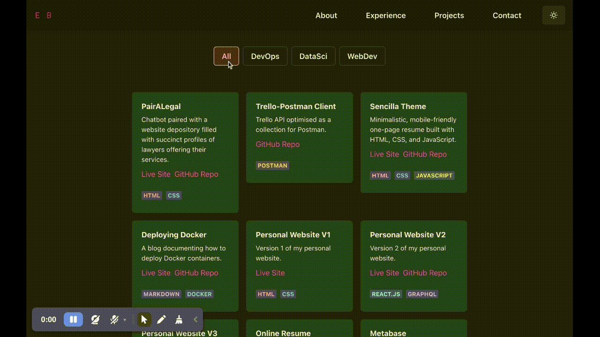

# Portfolio using React.js and Chakra UI

This portfolio is built using React.js and Chakra UI. It allows you to quickly create and customize your portfolio website using markdown files.

|        |  |
| :-----------------------------------------: | :-------------------------------: |
|       Document your work experiences        |    Showcase your best projects    |
|  |      |
|        Include your smaller projects        |     Mobile-responsive design      |

## Getting Started

To get started with development, you can use the following commands:

```
# Install dependencies
npm install

# Start the development server
npm start

# Build the static files
npm build
```


## Usage

You may use this template for your own portfolio as long as you give me proper credit by linking back to my profile.

For more details on hosting this site, you may refer to [A Step-by-Step Guide: Deploying on Netlify](https://www.netlify.com/blog/2016/09/29/a-step-by-step-guide-deploying-on-netlify/)
